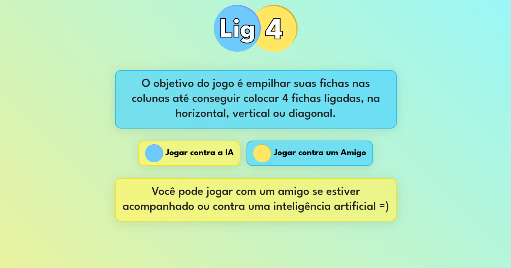
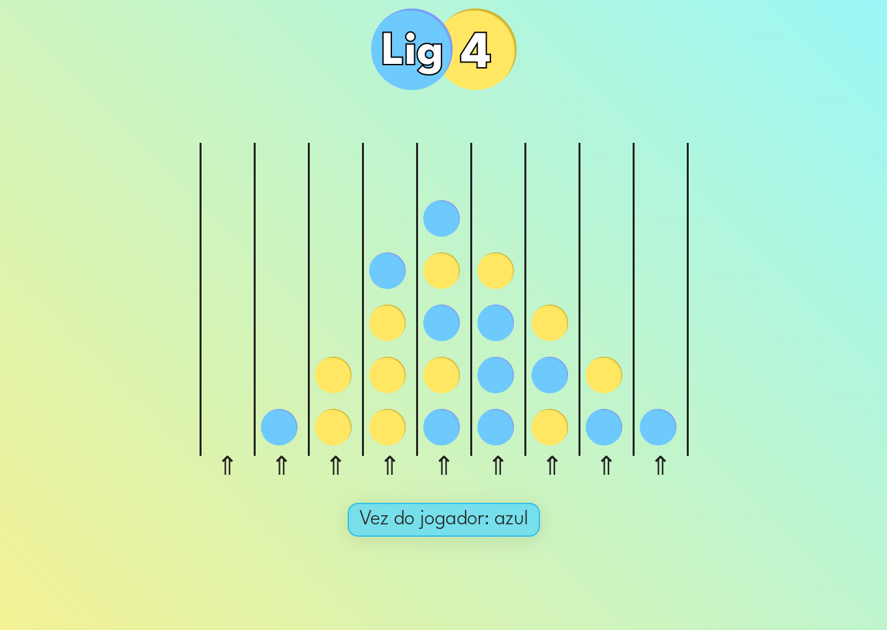
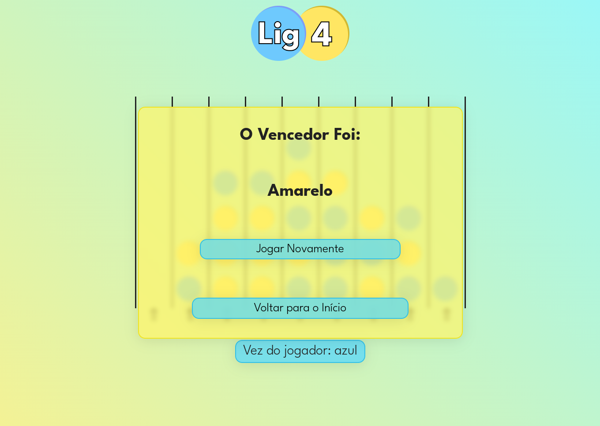

# Ligue 4

Um jogo online desenvolvido com HTML, CSS e JS puros. Usando o algoritmo Minimax para criar uma inteligência artificial capaz de jogar esse jogo.

| :placard: Vitrine.Dev |     |
| -------------  | --- |
| :sparkles: Nome        | **Ligue 4**
| :label: Tecnologias | HTML, CSS, JS
| :rocket: URL         | <https://brenomorim.github.io/lig4/>

---

## Detalhes

O projeto foi desenvolvido baseando-se nos conteúdos do curso CS50AI, que introduz conceitos sobre inteligência artificial e algoritmos, assim como os treinamentos de JavaScript e front-end da Alura. O projeto está em produção através do GitHub Pages e utiliza somente JavaScript, HTML e CSS puros. A biblioteca Animate.css foi utilizada para fazer as animações.

---

## Páginas

### Página Inicial

Contém os links para a página de jogo, assim como uma chamada, explicando como o jogo funciona.

### Página do Jogo

Contém o "tabuleiro" do jogo, contendo o estado atual, assim como os botões de ação.

### Tela Final

Aparece quando o jogo está com um vencedor definido, mostrando quem foi o ganhador e contendo links para jogar novamente ou voltar para a página inicial.

---

## Estrutura do projeto

- assets: contém as imagens do projeto
  - amarelo.png: Ficha amarela
  - azul.png: Ficha azul
  - logo.png: Logo da Lig4
- css: contém o CSS das imagens
  - index.css: CSS da página inicial
  - jogo.css: CSS da página de jogo
  - style.css: Centraliza todos os imports de CSS e os estilos comuns
  - reset.css: Normaliza o CSS do navegador
- imagens: screenshots a serem usadas nesse arquivo README.md
  - pagina-inicial.png
  - pagina-jogo.png
  - tela-final.png
- scripts: contém os arquivos JS
  - index.js: Importa e executa as funções necessárias para fazer a página index funcionar
  - jogo.js: Centraliza todas as chamadas de função que controlam a lógica do jogo
  - util: Pasta que contém todas as funções auxiliares do projeto, separadas por arquivo e bem documentadas
  - util/ia: Pasta que centraliza a lógica de funcionamento da IA baseada no algoritmo minimax
- index.html: HTML da página inicial
- jogo.html: HTML da página de jogo
- favicon.ico: Ícone a ser mostrado na guia do navegador

---
